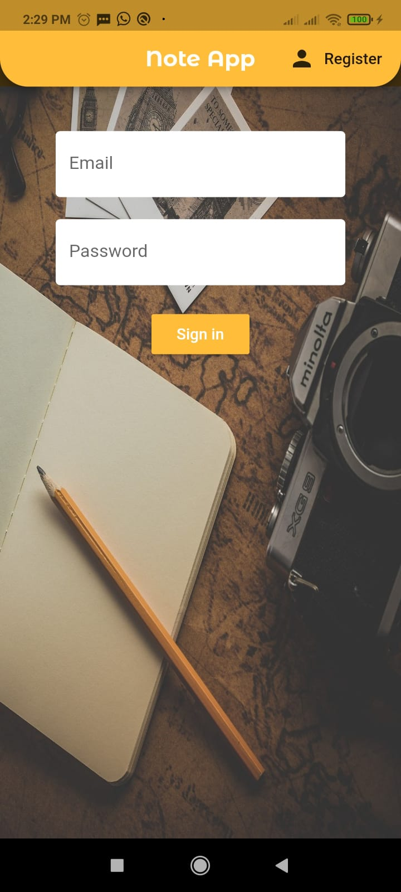
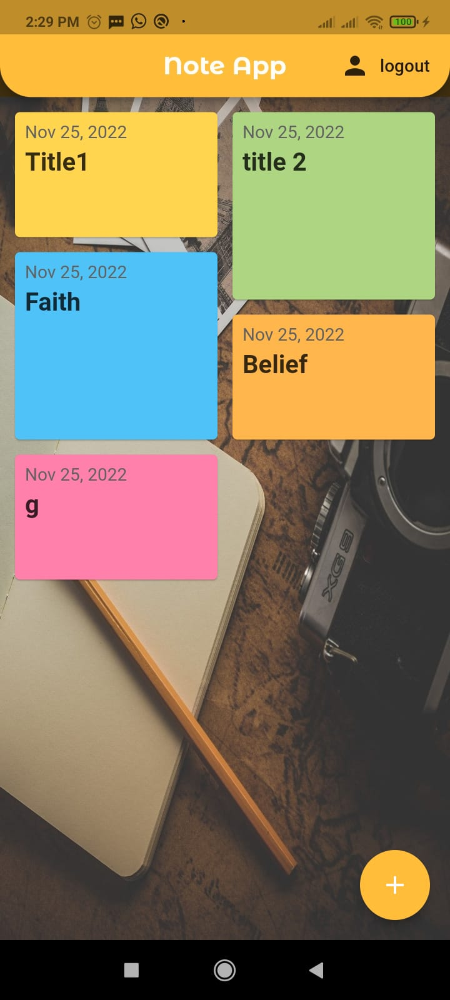
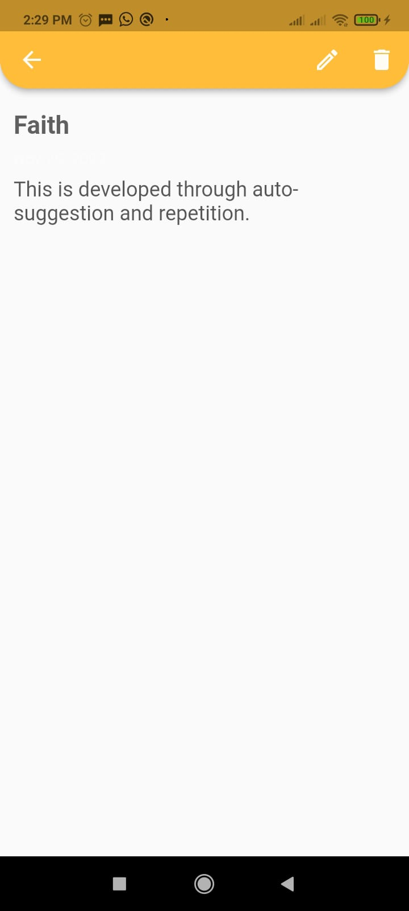
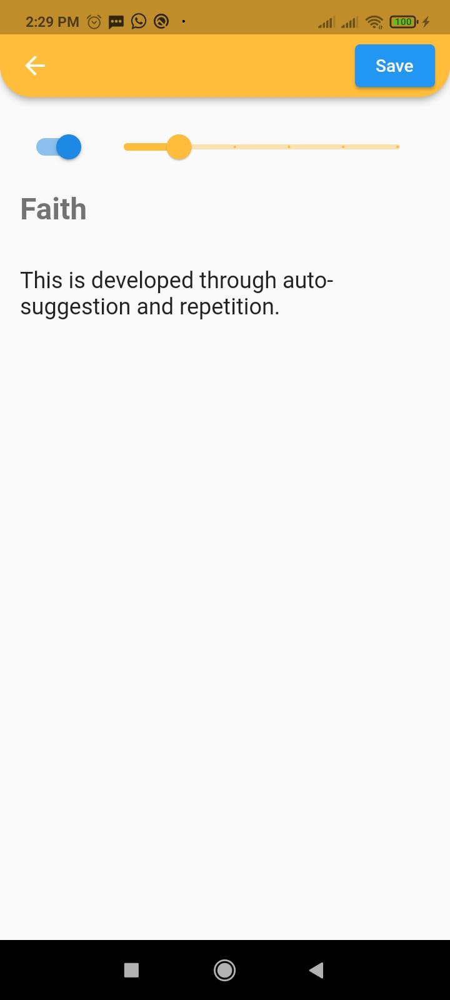

# note_app

Note app is a simple app to make notes, it uses CRUD operations of DBMS using SQLite and SQFlite. The notes are stored in local database inside the mobile.
I also added firebase authentication in another version which is in '1) authentication' branch.

Please clone different branches for different version of this app. Every new branch is added with some more updates.

  

    
  

  

    
  

  

    
  

 

  
  

## How to run project?

1) Clone the repository on your desktop
2) Open this folder in Visual Studio Code
3) Install the extensions like Flutter and Dart ( if not already)
4) If there shows to install missing packages, do click on " Install packages" 
5) Go to main.dart inside lib folder and press F5 ( only after connecting the mobile to your desktop or switching on the emulator)
6) Wait to see the note app on screen
8) Once everything is good, build the apk file for app by running in terminal the following command " flutter build apk".
9) Enjoy 
 
 Preferences : https://youtu.be/UpKrhZ0Hppk
